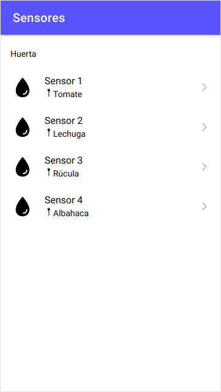
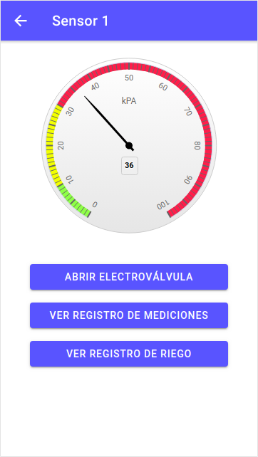
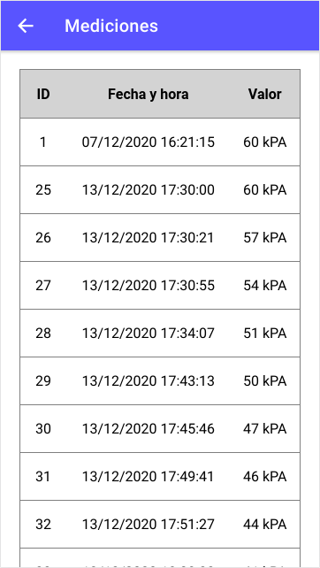
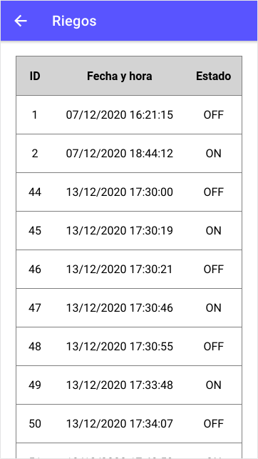

# Trabajo Práctico Final

Autor:

* Agustín Curcio Berardi

Docente:

* Brian Ducca

## Índice de contenidos

1. [Introducción general](#introducción)
2. [Instalación de dependencias](#instalación-de-dependencias)
3. [Implementación](#implementación)
4. [Ejecución de la aplicación](#ejecución-de-la-aplicación)
5. [Licencia](#licencia)

## Introducción general

El **Trabajo Práctico Final** de la materia **Desarrollo de Aplicaciones Multiplataforma** consiste en el desarrollo de una aplicación para controlar un sistema de riego automatizado. La propuesta consistió en aplicar los conceptos vistos en la materia para implementar una aplicación utilizando **Angular** para diseñar una página web y mediante el framework **Ionic** transformarla en una aplicación híbrida para dispositivos móviles.

## Instalación de dependencias

Para poder ejecutar el "backend" de la aplicación se debe tener instalado Docker, ya que toda esa parte del proyecto se encuentra concentrada en un contenedor. En caso de no contar con Docker instalado, se recomienda seguir la sección "Instalación de dependencias" espeficiada en el [siguiente repositorio](https://github.com/acurber91/daw-project), ya que se reutilizó el mismo contenedor empleado en la materia Desarrollo de Aplicaciones Web.

Por otro lado, para ejecutar la aplicación del "frontend" se requiere tener instalado el framework Ionic. Se diferencian dos situaciones.

### Node.js instalado con anterioridad

Si su computadora cuenta con Node.js instalado, seguramente cuente con el instalador **npm** que viene incluído por defecto, por lo que basta con ejecutar el siguiente comando para instalar el framework completo:

    $ npm install -g @ionic/cli

Para más información sobre cómo instalar Ionic con Node.JS, dirigirse a la [documentación oficial](https://ionicframework.com/docs/intro/cli).

### Node.js no instalado con anterioridad

En este caso será necesario instalar primero Node.js seguiendo la [página de descargas oficial](https://nodejs.org/en/). Una vez finalizada la instalación, se podrán seguir los pasos de la sección anterior para instalar Ionic.

## Implementación

### Introducción específica

La aplicación se ejecuta cuando un móvil se comunica con el servidor web mediante el envío de solicitudes HTTP. Dicho servidor utiliza la tecnología Node.js para que, una vez establecida la conexión, se intercambien datos y que la aplicación pueda mostrar la información de los dispositivos almacenados en la base de datos.

Para el diseño del **"frontend"** se utilizó framework **Ionic**, que es un SDK completo de código abierto para el desarrollo de aplicaciones móviles híbridas. En este caso, el desarrollo se realizó sobre **Angular**, otro "framework" utilizado para desarrollar aplicaciones web en TypeScript, de código abierto y mantenido por Google.

En cuanto al diseño del sitio, Ionic ya incorpora los principios de diseño de **Material Design** en caso de que aplicaciones para **Android** y **Apple Design** en caso **iOS**.

Por otro lado, en cuanto al desarrollo del **"backend"** se utilizó **Express.js**, que tal cual su nombre lo indica es un "framework" de Node.js gratuito y "open source". A su vez, se implementó una base de datos **MySQL** junto con el gestor **phpMyAdmin**.

### Organización del proyecto

El proyecto se encuentra conformado por la siguiente estructura de directorios y archivos (los más relevantes a la aplicación):

    ├── app                                  # Directorio raíz de la aplicación.
    │   ├── back                             # Directorio para el backend de la aplicación
    │   │   ├── db                           # Directorio para los archivos de la BD.
    │   │   │   ├── data                     # Estructura y datos de la BD.
    │   │   │   └── dumps                    # Directorio de estructuras de la BD.
    │   │   │       └── estructuraTPDAM.sql  # Estructura con la BD "estructuraTPDAM".
    │   │   ├── src                          # Código del backend.
    │   │   |   ├── mysql                    # Código de conexión de la BD.
    │   │   |   ├── routes                   # Directorio de rutas a cada tabla de la BD.
    │   │   |   └── index.js                 # Código base del servidor de Express.
    │   └── front                            # Directorio para el frontend de la aplicacion
    │       ├── src/app/directives           # Módulo de directivas personalizadas.
    │       ├── src/app/dispositivo          # Page correspondiente a la vista de dispositivo.
    │       ├── src/app/home                 # Page correspondiente a la vista principal.
    │       ├── src/app/medicion             # Page correspondiente a la vista del registro de mediciones.
    │       ├── src/app/model                # Definición de clases personalizadas TypeScipt.
    │       ├── src/app/riego                # Page correspondiente a la vista del registro de riegos.
    │       ├── src/app/pipes                # Módulo de pipes personalizados.
    │       └── src/app/services             # Conjunto de servicios personalizados.
    ├── README.md                            # Archivo actual.
    ├── CHANGELOG.md                         # Archivo para guardar cambios.
    └── doc                                  # Documentación general del proyecto.

### Desarrollo del "frontend"

De acuerdo a las consignas del Trabajo Práctico Final, se implementaron las siguientes funcionalidades en el "frontend".

#### Dar un listado de dispositivos

La consigna proponía mostrar el listado completo de dispositivos dentro de la aplicaciñon. Este listado se muestra ni bien se inicia la aplicación.

#### Mostrar la información de cada dispositivo

Al hacer "tap" en algún dispositivo, se despliega una vista que muestra el último valor de la medición a través de un gráfico tipo "gauge" y una serie de opciones.

#### Opción para abrir o cerrar la electroválvula

Cada sensor tiene asociada una electroválvula. Al hacer click en dicho botón, dependiendo del último estado de la válvula se abrirá o cerrará. Se distinguen dos situaciones:

* En caso de que la válvula esté **abierta**, se cerrará generando un "log" en las tablas **Log_Riegos** y  **Mediciones**.
* Por otro lado, en caso de que la válvula esté **cerrada**, solamente se generará un "log" en la tabla **Log_Riegos**.

#### Opción para ver registro de mediciones

Al hacer "tap" en el botón **Ver registro de mediciones**, se mostrará una tabla al usuario con todo el historial de mediciones asociadas a dicho sensor en particular.

#### Opción para ver registro de riegos

Al hacer "tap" en el botón **Ver registro de riegos**, se mostrará una tabla al usuario con todo el historial de riegos asociadas a dicho sensor en particular.

### Desarrollo del "backend"

La consigna requería entregar una API desarrollada en **Express**. Así, se incluyó dentro de un contenedor Docker la API en cuestión, la cual está conformada por:

* Una imagen de Node.js junto con Express.
* Una base de datos MySQL.
* Un gestor de base de datos phpMyAdmin.

Dependiendo del tipo de tabla que se consulte, la API soporta métodos GET y POST.

## Ejecución de la aplicación

### Inicialización del "backend"

Una vez que se han instaladas todas las dependencias se podrá ejecutar la aplicación. Para ello, se deberá descargar éste repositorio.

    git clone https://github.com/acurber91/dam.git

Para inicializar el contenedor, primero se debe acceder al directorio donde se descargó el repositorio.

    cd dam/app/back

Y ejecutar el siguiente comando.

    docker-compose up

Una vez iniciado, ya se contará una la API en funcionamiento. Para cerrar el contenedor, se puede correr el comando ``docker-compose down`` desde otra terminal o bien utilizar el shortcut ``Ctrl+C``, obteniendo el mismo resultado.

> **NOTA**: La primera vez que se ejecuta el comando ``docker-compose up`` es probable que la base de datos MySQL arroje un error y en la aplicación no aparecerá ningún dispositivo, es decir, solo se mostrará el "cascarón". Si eso sucediera, será necesario reiniciar el contenedor. Para ello, cerrarlo con ``docker-compose down`` y volver a iniciarlo con ``docker-compose up``.

### Inicialización del "frontend"

Para mostrar la aplicación a través de una pestaña de un explorador web, se necesita acceder al siguiente directorio

    cd dam/app/front

Y ejecutar el siguiente comando.

    ionic serve

Con éste último comando, la aplicación comenzará a compilar y en caso de que no existan errores, abrirá una nueva pestaña en la dirección ``http://localhost:8100/home``. Una vez abierta, es posible navegar a través de la misma utilizando la vista web o bien simulando un dispositivo móvil, haciendo ``Ctrl + Shift + I`` para acceder a las herramientas de desarrollador desde un navegador basado en Chromium.

## Licencia

Este proyecto se encuentra publicado bajo la licencia GPLv3. En [este enlace](https://www.gnu.org/licenses/quick-guide-gplv3.html) podrá encontrar más información sobre la misma.

